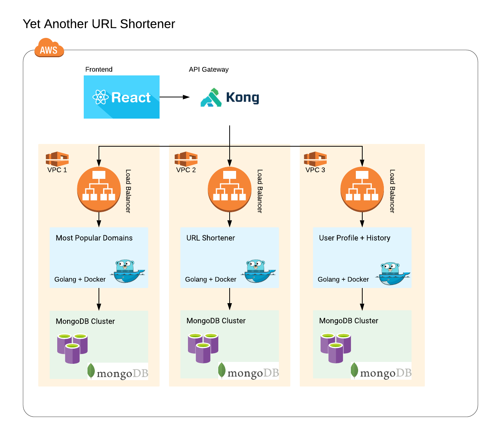

# Yet Another URL Shortener
For the CMPE 281 Team Hackathon project, we created a URL shortener application with 3 core microservices. The project is implemented with React.js as the frontend, Golang as the backend microservices, and MongoDB as the NoSQL database. In addition, we use Docker containers (containers are the future!) and to create reproducible environments and for deploying.

## Architectural Diagram

## Core Features / Microservices
- URL Shortener
- Most Popular Domains
- User Profile with History of past URLs
